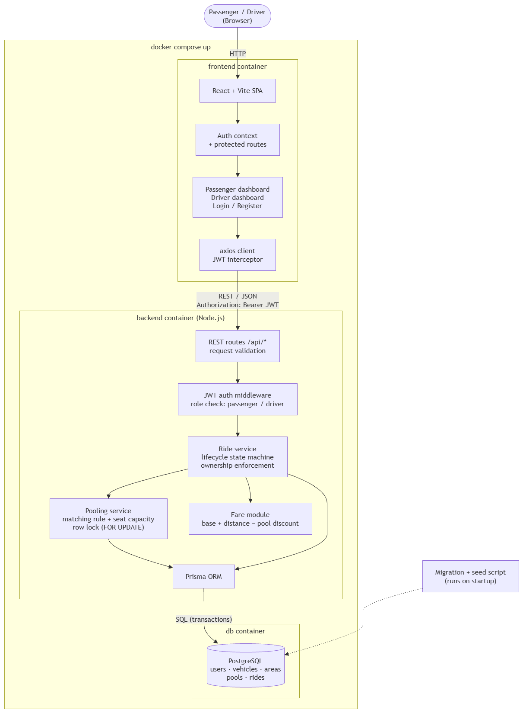
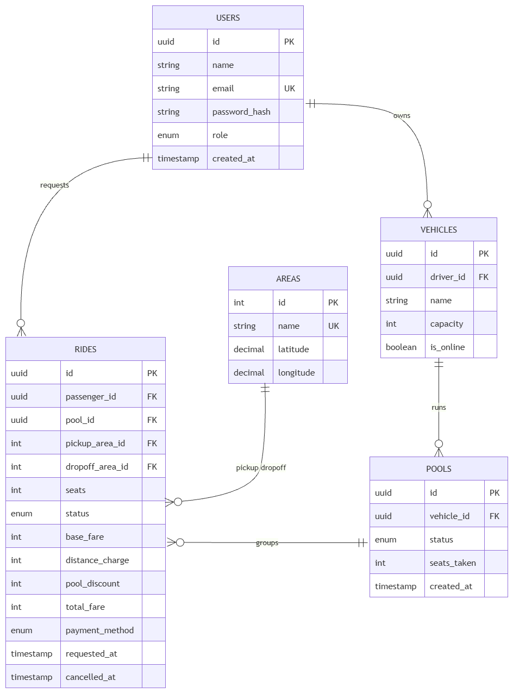

# Dhaka Tesla Pool

Share a seat. Split the fare. Survive Dhaka traffic.

## Summary

Dhaka Tesla Pool is a ride-pooling MVP built for the RoBenDevs internship take-home
challenge. Three passengers, one driver, and a three-seat battery rickshaw ("Tesla")
named Bullet make up the story cast used throughout the seed data, tests, and demo:
Jashim (driver), Nusrat, Rafiq, and Shirin (passengers).

## The problem

Nusrat wants to go from Banani to Mohakhali. Rafiq, a stranger, wants to go from
Banani to Gulshan 1 at almost the same time. Jashim's Tesla has three seats. The
system has to decide — in about a second — whether Nusrat and Rafiq can share a
ride, split the fare fairly between them, and track the trip from request to
completion, all while keeping each passenger's fare and status private to them.

This project is the MVP built to solve that: passengers can request rides and get
pooled together when it makes sense, drivers can accept and run pooled trips, and
every ride's full history is kept for later review.

## Features implemented

- **Passenger**: register/login, request a ride (pickup, destination, seats), see
  an estimated fare, track status live (`REQUESTED → MATCHED → DRIVER_ARRIVED →
  STARTED → COMPLETED`, or `CANCELLED`), cancel while the ride hasn't started, view
  ride history with final fares
- **Driver**: register/login, register a vehicle, go online/offline, see unmatched
  nearby requests, accept a ride (opening a new pool or joining an existing one),
  advance a pool through arrival → start → completion
- **Pooling**: a simple area+corridor matching rule decides who can share a ride;
  seat capacity is enforced with a database-level row lock so two simultaneous
  claims for the last seat can never both succeed
- **Fares**: an integer-poysha fare model (`base + distance×rate`, with a 20% pool
  discount once 2+ passengers share a ride), hand-verifiable for Nusrat and Rafiq's
  trip (see [Fare model](#fare-model) below)
- **Full audit trail**: every ride status change is recorded as its own event, not
  just overwritten

## Tech stack

| Layer | Choice | Why |
|---|---|---|
| Frontend | React (Vite) | Fast dev server (native ES modules, no bundler in dev), simpler than Next.js for a client-only SPA with no SSR/routing-on-the-server need |
| Backend | Node.js + Express | Lightweight for an MVP this size; every route is easy to trace and defend line by line, versus NestJS's heavier DI/module ceremony |
| Database | PostgreSQL 16 | Relational data (users, vehicles, pools, rides all foreign-keyed together), transactions + row locking (`SELECT ... FOR UPDATE`) needed for the seat-concurrency problem, native enums for status/area |
| ORM | Prisma 7 (with `@prisma/adapter-pg`) | Single schema file generates both migrations and a type-safe client; adapter lets Prisma run over the standard `pg` driver |
| Auth | JWT + bcrypt | Stateless (no session store needed for an MVP), bcrypt for one-way password hashing |
| Validation | Zod | Schema-based request validation as middleware, before any business logic runs |
| Testing | Jest + Supertest | Jest for unit + integration, Supertest for hitting the Express app directly without binding a real port |
| Containerization | Docker Compose | One `docker compose up` builds and runs Postgres, the API, and the frontend together, with migrations and seed data applied automatically |

**Alternatives considered:** MySQL/SQLite for the database (Postgres won on
row-locking and native enum support), NestJS for the backend (more structure than
an MVP of this size needs), Redux for frontend state (React Context was enough
for the small amount of shared auth state). None of these were built only to look
impressive — the PRD explicitly warns against that, and every choice above is one
we'd actually defend in the interview.

## Architecture
```
Browser (Passenger / Driver)
│
▼
React (Vite) SPA ──REST + JSON, Bearer JWT──▶ Node.js + Express API
routes → controllers → services
│
▼
PostgreSQL 16 (via Prisma)


```

Inside the API:
- **routes/** — URL + HTTP verb mapping only
- **controllers/** — parse the request, call a service, shape the HTTP response
- **services/** — business rules (matching, fare, state transitions, seat capacity) — framework-agnostic, unit-testable without Express or Prisma running
- **middleware/** — auth (JWT verification + role guard), request validation, central error handler





## Project structure

```
dhaka-tesla-pool/
├── backend/
│   ├── prisma/
│   │   ├── schema.prisma        # Single source of truth for the data model
│   │   ├── migrations/          # Generated SQL migrations
│   │   └── seed.js              # Demo users, vehicle, and rides
│   ├── src/
│   │   ├── routes/              # URL + HTTP verb mapping only
│   │   ├── controllers/         # Request parsing, response shaping
│   │   ├── services/            # Business rules (matching, fare, seats, state)
│   │   ├── middleware/          # auth, role guard, Zod validation, error handler
│   │   ├── app.js               # Express app (exported for Supertest)
│   │   └── server.js            # Binds the port
│   ├── tests/                   # Jest unit + Supertest integration tests
│   └── Dockerfile
├── frontend/
│   ├── src/
│   │   ├── components/
│   │   ├── pages/
│   │   ├── context/             # Auth context (JWT + current user)
│   │   └── api/                 # Fetch wrapper that attaches the Bearer token
│   └── Dockerfile
├── docs/
│   ├── architecture.png
│   └── erd.png
├── docker-compose.yml
├── .env.example
└── README.md
```

## Prerequisites

| Tool | Version | Needed for |
|---|---|---|
| Docker + Docker Compose | Docker 24+ | Recommended path: runs everything with one command |
| Node.js | 20 LTS or newer | Only for running without Docker, or running tests locally |
| PostgreSQL | 16 | Only for running without Docker |
| Git | any recent | Cloning the repo |

## Environment variables

Copy `.env.example` to `.env` before running anything:

```bash
cp .env.example .env
```

| Variable | Example | Purpose |
|---|---|---|
| `POSTGRES_USER` | `tesla` | Database user (used by Docker Compose) |
| `POSTGRES_PASSWORD` | `change_me` | Database password |
| `POSTGRES_DB` | `tesla_pool` | Database name |
| `DATABASE_URL` | `postgresql://tesla:change_me@db:5432/tesla_pool` | Connection string used by Prisma (use `localhost` instead of `db` outside Docker) |
| `JWT_SECRET` | *(long random string)* | Signs auth tokens. Never commit a real value |
| `JWT_EXPIRES_IN` | `1d` | Token lifetime |
| `PORT` | `4000` | API port |
| `VITE_API_URL` | `http://localhost:4000` | Where the frontend sends API requests |

> `.env` is git-ignored. Only `.env.example` (placeholder values) is committed.

## Quick start (Docker)

The fastest way to run everything. Docker Compose starts Postgres, applies migrations, seeds demo data, and launches the API and frontend.

```bash
git clone https://github.com/mashraf02/dhaka-tesla-pool.git
cd dhaka-tesla-pool
cp .env.example .env
docker compose up --build
```

Once the containers are up:

| Service | URL |
|---|---|
| Frontend | http://localhost:5173 |
| API | http://localhost:4000 |
| Health check | http://localhost:4000/health |

To stop everything: `docker compose down`. To also wipe the database volume and start fresh: `docker compose down -v`.

## Local development (without Docker)

You'll need Node.js 20+ and a running PostgreSQL 16 instance.

**1. Backend**

```bash
cd backend
npm install
# In .env, point DATABASE_URL at localhost instead of the "db" host
npx prisma migrate dev      # applies migrations, generates the Prisma client
npx prisma db seed          # loads demo users, vehicle, and rides
npm run dev                 # API on http://localhost:4000
```

**2. Frontend** (in a second terminal)

```bash
cd frontend
npm install
npm run dev                 # SPA on http://localhost:5173
```

## Demo accounts

The seed script creates these accounts so you can try both roles right away:

| Role | Email | Password |
|---|---|---|
| Driver | `driver@example.com` | `Password123!` |
| Passenger | `passenger1@example.com` | `Password123!` |

## Running tests

Integration tests need the database running and migrated:

```bash
docker compose up -d db
cd backend
npx prisma migrate deploy
npm test                    # 8 suites, 45 tests
npm test -- --coverage      # with a coverage report
```

Unit tests cover `utils/` (fare, matching, state machine). Integration tests cover auth, vehicles, the ride lifecycle, an end-to-end story, and the seat-concurrency race. Statement coverage is about 79% in `services/` and 100% in `utils/`, `routes/` and `schemas/`.

## Fare model

All money is stored as **integer poysha** (100 poysha = 1 taka), so there are no floating-point rounding errors.

| Constant | Value |
|---|---|
| Base fare | 4,000 poysha (40 taka) |
| Per km | 1,500 poysha (15 taka) |
| Pool discount | 20%, only when 2+ passengers share the ride |

```
solo fare      = (base + distanceKm(pickup, destination) × per_km) × seats
pooled fare    = solo fare − floor(solo fare × 20 / 100)
```

Example for a 5 km trip, one seat: solo = 4,000 + 5 × 1,500 = 11,500 poysha (115 taka). Shared with another passenger, the discount is 2,300, so each pays 9,200 poysha (92 taka).

- When a request is created, the estimate is the **solo** fare.
- Whenever a passenger joins a pool, every active member's estimate is recalculated inside the same database transaction.
- When a ride reaches `COMPLETED`, the estimate is frozen into `finalFarePoysha`.

## API reference

Base URL: `http://localhost:4000/api`. All request and response bodies are JSON.

### Authentication

Protected routes need a JWT:

```
Authorization: Bearer <token>
```

Get a token from `POST /auth/login`. Routes are role-guarded (`PASSENGER` or `DRIVER`).

### Endpoints

| Method | Path | Role | Description |
|---|---|---|---|
| POST | `/auth/register` | Public | Create a passenger or driver account |
| POST | `/auth/login` | Public | Exchange credentials for a JWT |
| POST | `/rides` | Passenger | Request a ride (pickup area, destination area, seats) |
| GET | `/rides/mine` | Passenger | The passenger's ride history |
| POST | `/rides/:id/cancel` | Passenger | Cancel a ride that is still cancellable |
| GET | `/driver/vehicles` | Driver | List the driver's vehicles |
| POST | `/driver/vehicles` | Driver | Register a vehicle |
| PATCH | `/driver/vehicles/:vehicleId/online` | Driver | Set a vehicle online or offline |
| GET | `/driver/requests` | Driver | Open ride requests the driver can take |
| POST | `/driver/vehicles/:vehicleId/accept` | Driver | Accept a request; it joins a pool with seat capacity checked |
| GET | `/driver/pools/:poolId` | Driver | Pool details and its members |
| POST | `/driver/pools/:poolId/arrived` | Driver | Move the pool to `DRIVER_ARRIVED` |
| POST | `/driver/pools/:poolId/start` | Driver | Move the pool to `STARTED` |
| POST | `/driver/pools/:poolId/complete` | Driver | Move the pool to `COMPLETED` and freeze final fares |

### Example: request a ride

```bash
curl -X POST http://localhost:4000/api/rides \
  -H "Authorization: Bearer <token>" \
  -H "Content-Type: application/json" \
  -d '{"pickupArea":"BANANI","destinationArea":"DHANMONDI","seatsRequested":1}'
```

### Errors

Errors are produced by a central error handler. Services throw errors carrying an HTTP `status`.

| Status | Meaning |
|---|---|
| 400 | Request body failed Zod validation |
| 401 | Missing, invalid, or expired token |
| 403 | Authenticated, but wrong role for this route |
| 404 | Resource not found |
| 409 | Conflict: illegal status transition, or no seats left |
| 500 | Unexpected server error |

## Design decisions and trade-offs

**Business logic lives in services, not controllers.** Fare, matching, and state transitions sit in `services/` and `utils/` with no HTTP dependency, so they are unit-testable in isolation. Controllers stay thin.

**Seat capacity is enforced inside a database transaction.** Checking "seats left" in JavaScript and then writing would race under concurrent requests. The join flow locks the pool row with `SELECT ... FOR UPDATE` (`pool.service.js`), then checks capacity and writes in the same transaction. Two passengers racing for the last seat cannot both win; there is an integration test for exactly this (`pool-concurrency.test.js`). The trade-off is that requests for the same pool are serialized, which is fine at this scale.

**Fares are recalculated in the same transaction as the join.** Estimates for every active member update atomically with the seat change, so a passenger never sees a fare that disagrees with the pool's actual size.

**Money is integer poysha.** Exact arithmetic, with the discount rounded down explicitly (`Math.floor`).

**One state machine for ride status.** `utils/rideStateMachine.js` is the single source of truth: `REQUESTED → MATCHED → DRIVER_ARRIVED → STARTED → COMPLETED`, with `CANCELLED` reachable from any state before `STARTED`. `COMPLETED` and `CANCELLED` are terminal. Illegal transitions throw a `409`. The same table validates pool and member transitions.

**Stateless JWT auth.** No session store to run. The trade-off is that tokens can't be revoked before they expire.

**Validation before logic.** Zod schemas run as middleware, so services can assume well-formed input.

## Known limitations

- **No real-time updates.** The UI must poll or refresh to see pool changes.
- **Areas are a fixed enum**, not real geolocation. Distance comes from a lookup between area names.
- **No payment integration.** Fares are calculated, never charged.
- **No refresh tokens or revocation**, so a stolen JWT is valid until it expires.
- **No rate limiting or security headers** (`helmet`) on the API.
- **Integration tests need a live Postgres** with migrations applied. Service-layer coverage comes from those integration suites; the unit suites cover `utils/` only.
- **Single-instance deployment.** Docker Compose is for local and demo use.

## With more time

1. Real-time pool updates over WebSockets.
2. Route-aware matching using coordinates.
3. Refresh-token flow with revocation.
4. Rate limiting and `helmet`.
5. Frontend component tests and a browser end-to-end test.
6. CI running lint and tests on every push.

## Author

Built by [Mashraful](https://github.com/mashraf02) for the RoBenDevs internship challenge.
